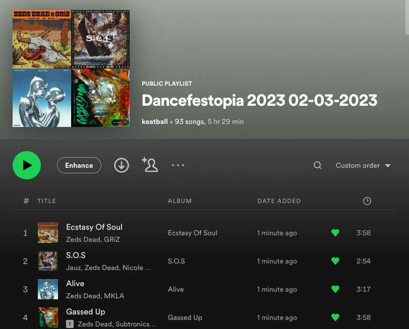
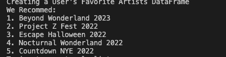

# Spotify Music Festival Playlist Generator and Recommender

Generates Spotify playlists for upcoming music festivals based on artists' the user listens to. Recommends music festival for the users based on their top artists.

## Description

### Main
- **Main** has 3 methods - getUserArtist(), recommend(), create_playlist() 
- **getUserArtist** uses Spotify API calls to create a dataframe with information about the user's favorite artists and other similar artists  
- **recommend** creates a list of the 5 festivals the user is most likely to want to attend. User can input only select time ranges and location
- **create_playlist** takes in a festival name and creates a Spotify playlist with the top songs from artists the user listens to at the Music festival.

### FestivalDB
- **FestivalDB** is a folder with Festival_Characteristics.xlsx and CreateLineups.
- **CreateLineups** uses Selenium and BeautifulSoup to mine Music Festival Wizard (https://www.musicfestivalwizard.com/) for festival names, dates, locations and artists attending. This data is used to create Festival_Characteristics.xlsx.
- Current URL mines 148 EDM festivals in the Unites States from July 1st 2022 to December 31st 2023 with released lineups.

### Access
- Spotipy Authentication Guide https://www.section.io/engineering-education/spotify-python-part-1/

## Dependencies
- python 3.10
- Run "pip install -r requirements.txt" to download packages
- Download ChromeDriver (https://chromedriver.chromium.org/downloads) 

## Example Results

